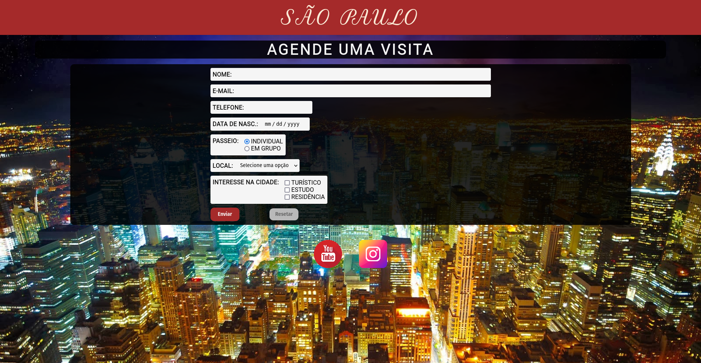

## Checkpoint 02 - Front End I - Turma 01

#### [Digital House - Certified Tech Developer](https://brennomachado.github.io/DigitalHouse/)

Aluno: Brenno Pereira Machado

A página pode ser visualizada em: [https://brennomachado.github.io/DigitalHouse/checkpoints/Frontend-I/02/](https://brennomachado.github.io/DigitalHouse/checkpoints/Frontend-I/02/)

---

## Objetivo

O objetivo do trabalho é desenvolver habilidades na criação de formulários, animações e pseudo-seletores.

## Instruções

Você provavelmente fez o checkpoint I, então imaginamos este trabalho como uma continuação dele. O trabalho será criar uma nova página com um formulário de cadastro. Seguem requisitos para a criação das páginas.

<ol>
  <li type="numbers">O trabalho deve ser realizado em grupo de no máximo 3 pessoas.</li>
  <li type="numbers">O formulário de cadastro deve ter no mínimo os inputs:
    <ol>
      <li type="a">Nome (com no máximo 100 caracteres)</li>
      <li type="a">Email</li>
      <li type="a">Telefone (apenas números)</li>
      <li type="a">Data de nascimento (data)</li>
      <li type="a">Se é maior ou menor de idade (deve ter as duas opções, podendo marcar apenas uma delas).</li>
      <li type="a">Um campo que permita que o usuário selecione um ponto de interesse na sua cidade. (De uma lista de no mínimo 3).</li>
      <li type="a">Um campo opcional onde o usuário poderá dizer quais seus interesses na cidade: Turista, Residente e Estudante. Note que o usuário pode escolher nenhum ou mais que um.</li>
      <li type="a">O formulário deve ter um botão para enviar e um botão para resetar os dados digitados.</li>
    </ol>
  </li>
  <li type="numbers">O formulário deve ter uma animação onde quando o usuário passa o cursor do mouse sobre o campo e o campo aumenta de tamanho. </li>
  <li type="numbers">Você tem total liberdade para animar e colorir o seu formulário, então use e abuse da sua criatividade</li>
  <li type="numbers">Suba o trabalho no Github e no GitPages ou no Replit e envie o link pelo formulário a seguir ATÉ 29/11 23:59:  Link do Formulário de Entrega</li>

</ol>

## Conclusão

Parabéns! Você acaba de finalizar o segundo checkpoint de frontend!
